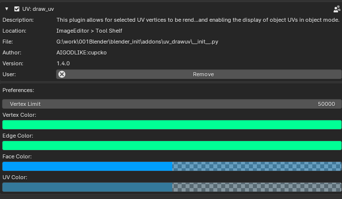
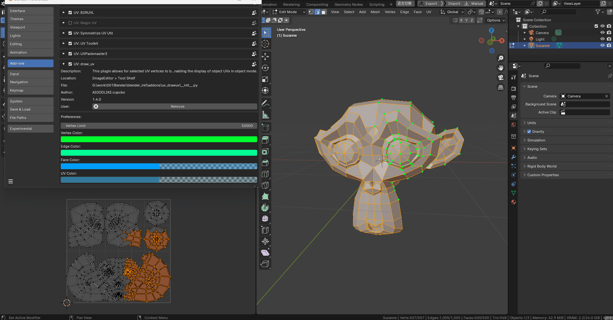
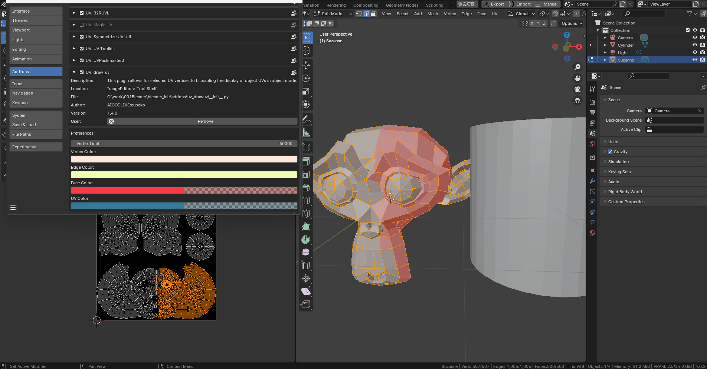
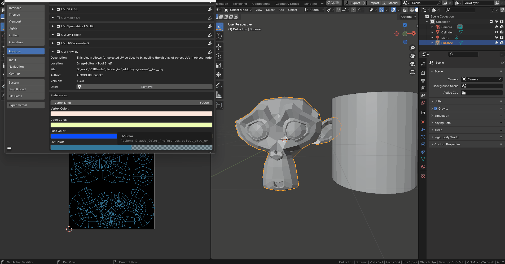
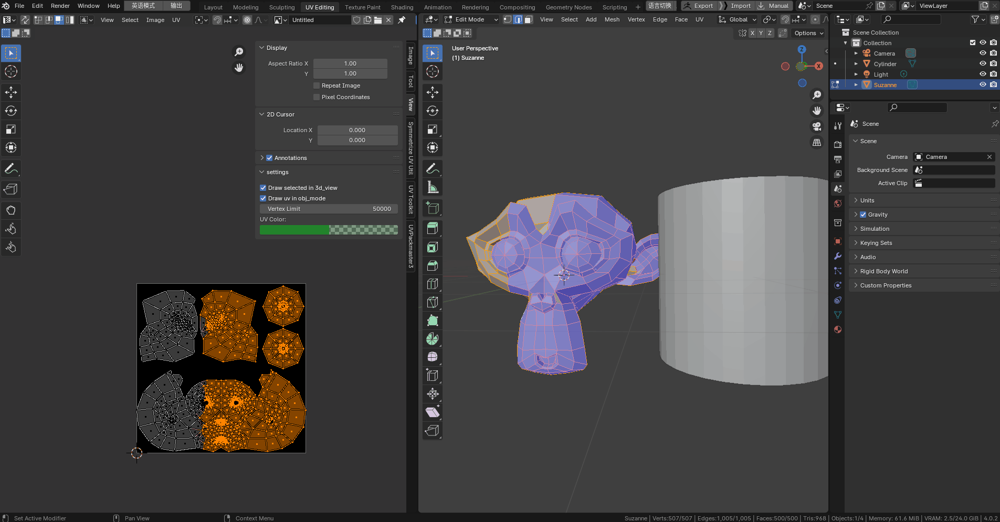
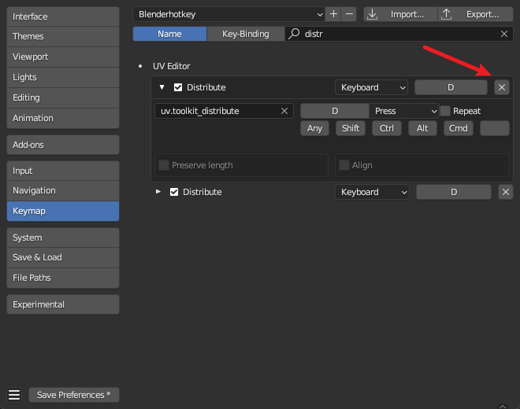

# 2023/11/02uv高亮绘制插件

可以在禁用uv同步模式下，将选择的uv顶点在3d视图中绘制出来

可以在物体模式下显示物体uv

This addon allows for selected UV vertices to be rendered in the 3D view,and enabling the display of object UVs in object mode.

# 插件面板Plugin panel

#### 在插件面板中可以设置渲染颜色和顶点数限制

You can configure rendering colors and vertex count limits in the plugin panel

#### 顶点限制：超过目标定点数后停止渲染

Vertex Limit: Stop rendering after exceeding the target number of vertices

#### 可以设置3d视图渲染的点线面颜色

You can set the colors of points, lines, and surfaces for 3D view rendering

#### 面模式可以设置面的透明度

You can adjust the transparency of surfaces in surface mode

#### 可以设置物体模式下uv的颜色

You can set the color of UVs in object mode

# UV Editor n\_panel

### 绘制开关draw toggle

# 已知缺陷known issues

物体模式下会出现在render result图片上，可在n\_panel关闭渲染，不会随着图片导出

Objects in object mode will appear in the render result image, and you can disable rendering in the N-panel, which won't affect image exports

需要关闭键盘映射UVEditor中的distribute项，此项会在按住d键时重置Bmesh数据导致uv混乱

You need to disable the 'distribute' option in the UVEditor keyboard mapping. This option resets the Bmesh data and causes UV confusion when holding down the 'd' key

